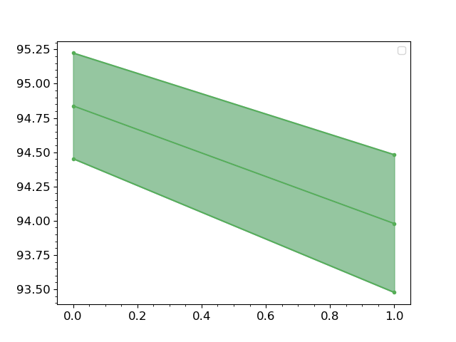
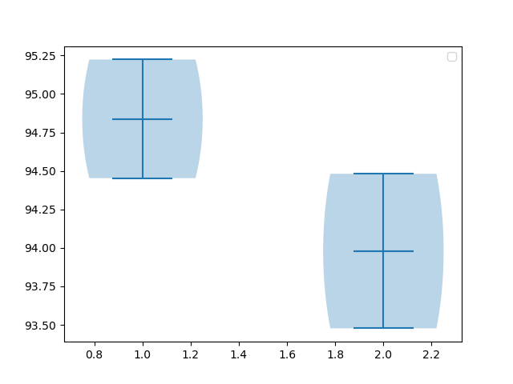

# MetricVisualizer - for easy managing performance metric

## Install 
```bash
pip install metric_visualizer
```
## Usage

```python3
from metric_visualizer import MetricVisualizer

# MV = MetricVisualizer({
#                 'Metric1': [80.41, 79.78, 81.03, 80.09, 79.62, 80.56, 80.88, 79.94, 79.47, 79.78, 80.72, 79.78, 81.35, 80.88, 81.03],
#                 'Metric2': [76.79, 75.49, 77.92, 77.21, 75.63, 76.96, 77.44, 76.26, 76.35, 76.12, 76.12, 76.78, 75.64, 77.31, 73.79]
#             })
MV = MetricVisualizer()

...

for epoch in epochs:
    acc, f1 = evaluate(model, test_dataloader)
    MV.add_metric('Accuracy', 96.5)
    MV.add_metric('F1', 94.1)

...

save_path = '{}_{}'.format(model_name, dataset_name)
MV.summary(save_path=save_path)  # save fig into .tex and .pdf foramt
MV.traj_plot(save_path=save_path)  # save fig into .tex and .pdf foramt
MV.violin_plot(save_path=save_path)  # save fig into .tex and .pdf foramt
MV.box_plot(save_path=save_path)  # save fig into .tex and .pdf foramt

MV.summary(save_path=None)  # show the fig via matplotlib
MV.traj_plot(save_path=None)  # show the fig via matplotlib
MV.violin_plot(save_path=None)  # show the fig via matplotlib
MV.box_plot(save_path=None)  # show the fig via matplotlib
```

## Example
See the plot definition of plot function to customize figure params, e.g., fig title, xlabel, ylabel.
Currently, only simple figures are supported, you can make complex figure by assemble the `.tex` file.

### Traj Plot


### Box Plot


### Violin Plot
